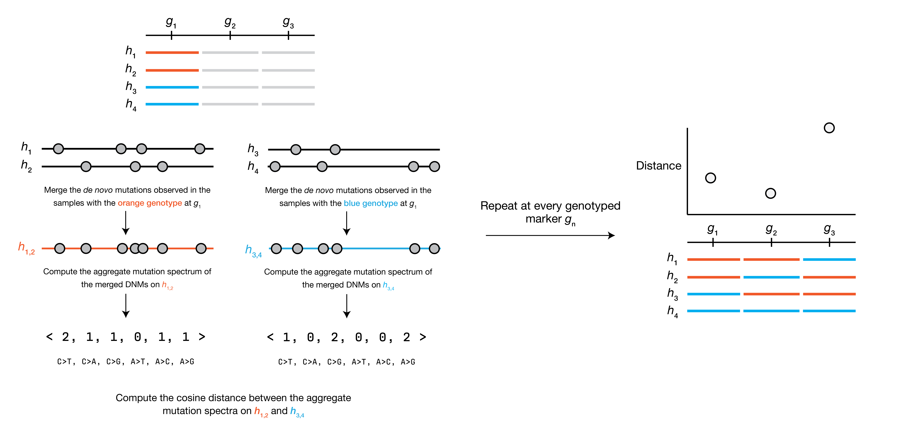
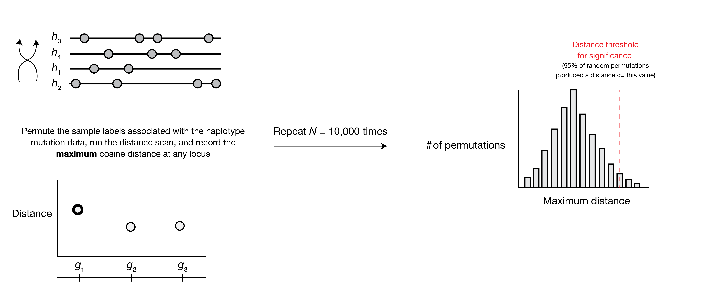

# Mapping mutator alleles with inter-haplotype distance

[](https://quinlan-lab.github.io/proj-mutator-mapping/reference/) 


## Summary

Identify alleles that affect the mutation spectrum in bi-parental recombinant inbred crosses. 

### Overview of method



> **Overview of inter-haplotype distance method.**
> In this toy example, a collection of 4 haplotypes ($h_1$ through $h_4$) have been genotyped as either “orange” (allele A) or “blue” (allele B) at each of three loci ($g_n$). In each of these 4 haplotypes, we have also identified de novo germline mutations, shown as filled grey dots along the lengths of the haplotypes. At the first site $g_1$, we group the haplotypes by their genotype at $g_1$,  compute the aggregate mutation spectrum in each group, and compute the cosine distance between those two aggregate mutation spectra. We then repeat this process at each genotyped site.



> **Overview of permutation test to determine significance thresholds.**
> To establish a threshold for the distance metric at a particular $p$ value (in this example, $p = 0.05$), we perform $N = 10,000$ permutations. In each permutation, we shuffle the labels associated with each haplotype's mutation data,  re-run the distance scan as outlined above, and store the maximum distance encountered at any genotyped site. Since the haplotype labels no longer correspond to the appropriate mutation data, these trials provide us with an estimate of the maximum inter-haplotype distance we'd expect to see by chance alone. We can then take the $\left(1 - p\right)$ percentile of the distribution of maximum distances as our threshold for determining if any experimental peaks are "significant."

## Requirements

### Python dependencies

These methods were written in Python 3.9.6, and the full list of dependencies is provided in `requirements.txt`.

Dependencies can be installed with `pip install -r requirements.txt`.

> I recommend using [`pyenv`](https://github.com/pyenv/pyenv) and [`pyenv-virtualenv`](https://github.com/pyenv/pyenv-virtualenv) to manage Python environments.

### Description of input files 

Before running an inter-haplotype distance (IHD) scan, you'll need to prepare a
small number of input files.


1. ***De novo* germline mutation data**

    Mutation data should be in a CSV file with **three required columns** as follows:

    | sample | kmer | count |
    | - | - | - |
    | sample_A | CCT>CAT | 1 |
    | sample_A | TGG>TCG | 1 |
    | sample_B | GCA>GAA | 1 |


    **Notes:**

    > The `kmer` column *must* contain mutation types in the 3-mer format shown above -- the format will be validated at runtime.

    > The CSV file can contain either a) one row for every individual mutation observed in each sample, in which case the `count` column should always be set to 1 or b) the aggregate count of every mutation type observed in the sample, in which case the `count` column will reflect the total number of each mutation type observed in the sample.

    > The dataframe can have any number of additional columns, but only the three defined above will be used.

2. **Marker genotypes**

    Genotype data should be formatted in a similar fashion as in [R/qtl2](https://kbroman.org/qtl2/). Genotypes should be in a CSV file with N rows, where N is the number of genotyped markers. There should be a single column denoting the marker name, and as many columns as there are samples. See below:

    | marker | sample_A | sample_B | sample_C |
    | - | - | - | - |
    | rs001 | B | B | D |
    | rs002 | H | D | B |
    | rs003 | D | D | D |


3. **Marker information (optional)**

    If you wish to generate Manhattan-esque plots that summarize the results
    of an IHD scan, you'll need to provide a final CSV that links marker IDs with
    either physical or genetic map positions (or both). This file should contain a column called `marker`, a column called `chromosome`, and a column specifying one or both of `cM` or `Mb`.

    | marker | chromosome | cM | Mb |
    | - | - | - | - |
    | rs001 | 1 | 1 | 4.5230 |
    | rs002 | 1 | 2.6 | 5.1994 |
    | rs003 | 1 | 2.8 | 5.4872 |


4. **Configuration file**

    The final required file specifies the *absolute* paths to the marker genotypes and associated metadata, and defines the genotypes that are present in the marker genotype file. This configuration file should be JSON-formatted and look something like this:

    ```
    {
        "genotypes": {
            "B": 0,
            "D": 2,
            "H": 1
        },
        "geno": "path/to/geno/csv",
        "markers": "path/to/marker/metadata/csv"
    }
    ```

    **Notes:**

    > The `genotypes` dictionary should map the observed genotypes in file #2 to integer values that will be used during the IHD scan.

    > The two parental alleles *must* be mapped to values of 0 and 2, respectively. Heterozygous and unknown genotypes *must* be mapped to values of 1.

## Usage

### Running the full pipeline on BXD data

Using *de novo* germline mutation data from the BXD recombinant inbred mouse lines (originally generated in [Sasani et al. [2022]](https://www.nature.com/articles/s41586-022-04701-5)), the IHD scan and plotting scripts can be run in a single command using `snakemake` as follows:

```
snakemake -j1 -s scripts/run_pipeline.smk
```

If desired, the  `-j` parameter can be used to set the number of jobs that should be executed in parallel when running the pipeline. 

This pipeline will download *de novo* germline mutation data for the BXDs, annotate it with relevant metadata, run a genome-wide IHD scan, find any significant markers, and plot the results of the scan.

### Running an inter-haplotype distance scan

Once you have assembled the input files above, a scan can be performed as follows:

```
python scripts/run_ihd_scan.py \
        --singletons /path/to/mutation/csv \
        --config /path/to/config/json \
        --out /name/of/output/csv \
```

There are a small number of optional arguments:

* `-k` sets the kmer size to use for the mutation types (k = 1 will compute distances between aggregate 1-mer mutation spectra, k = 3 will compute distances between aggregate 3-mer mutation spectra). Default value is 1. 

* `-permutations` sets the number of permutations to use when calculating significance thresholds for the IHD scan. Default value is 1,000.

### Plotting the results of an IHD scan

```
python scripts/plot_ihd_results.py \
        --results /path/to/output/csv \
        --markers /path/to/marker/metadata/csv \
        --outpref output_prefix
```

There is one optional argument, `-colname`, that can be used to specify the name of the column in the marker metadata CSV that indicates the physical/genetic map position you wish to plot in the Manhattan plot. The argument defaults to "Mb."

## Running tests

Tests can be run using `pytest` from the root level of the project directory as:

```
pytest .
```

## Project layout

    scripts/
        run_ihd_scan.py             # wrapper that calls utilities for computing inter-haplotype distances (IHD)
        plot_ihd_scan.py            # code used to plot results of IHD scans
        utils.py                    # bulk of the actual methods used for IHD
        schema.py                   # pandera schema used to validate dataframes
    tests/
        fixtures.py                 # fixtures used by `pytest`
        test_utils.py               # testing suite for methods in `utils.py`
    data/
        genotypes/                  # directory containing formatted `.geno` files for the BXDs that contain sample genotypes at every tested marker
        json/                       # directory containing JSON configuration files for IHD scans using the BXDs
        mutations/                  # directory containing per-sample *de novo* mutation data in the BXDs
        bam_names_to_metadata.xlsx  # Excel file with metadata about the BXD RILs
