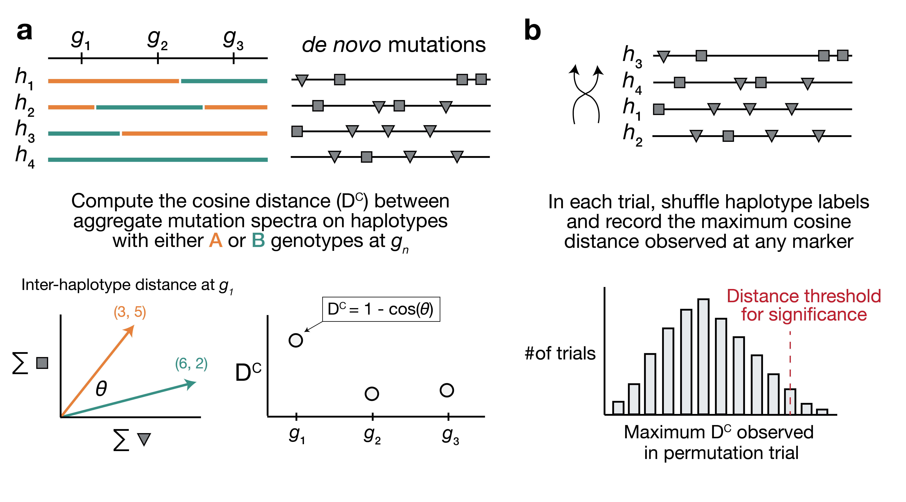

# Epistasis between mutator alleles contributes to germline mutation spectra variability in laboratory mice

[](https://quinlan-lab.github.io/proj-mutator-mapping/reference/) 

[](https://zenodo.org/badge/latestdoi/592930309)

## Summary

This repository includes:

1. Python code underlying the aggregate mutation spectrum distance (AMSD) method described in our [latest manuscript](https://elifesciences.org/reviewed-preprints/89096).

2. A [`snakemake`](https://snakemake.readthedocs.io/en/stable/index.html) pipeline that can be used to reproduce all figures and analyses from the manuscript in a single command.

### Overview of aggregate mutation spectrum distance (AMSD) method



> **Overview of aggregate mutation spectrum distance method.**
> **a)** A population of four haplotypes has been genotyped at three informative markers ($g_1$ through $g_3$); each haplotype also harbors unique *de novo* germline mutations.
In practice, *de novo* mutations are partitioned by $k$-mer context; for simplicity in this toy example, *de novo* mutations are simply classified into two possible mutation types (grey squares represent C>(A/T/G) mutations, while grey triangles represent A>(C/T/G) mutations). **b)** At each informative marker $g_n$, we calculate the total number of each mutation type observed on haplotypes that carry either parental allele (i.e., the aggregate mutation spectrum) using all genome-wide *de novo* mutations. For example, haplotypes with *A* (orange) genotypes at $g_1$ carry a total of three "triangle" mutations and five "square" mutations, and haplotypes with *B* (green) genotypes carry a total of six triangle and two square mutations. We then calculate the cosine distance between the two aggregate mutation spectra, which we call the "inter-haplotype distance." Cosine distance can be defined as $1 - \cos(\theta)$, where $\theta$ is the angle between two vectors; in this case, the two vectors are the two aggregate spectra. We repeat this process for every informative marker $g_n$. **c)** To assess the significance of any distance peaks in b), we perform permutation tests. In each of $N$ permutations, we shuffle the haplotype labels associated with the *de novo* mutation data, run a genome-wide distance scan, and record the maximum cosine distance encountered at any locus in the scan. Finally, we calculate the $1 - p$ percentile of the distribution of those maximum distances to obtain a genome-wide cosine distance threshold at the specified value of $p$.

## Requirements

### Python dependencies

All methods were written in Python 3.9.6, and the full list of dependencies is provided in `requirements.txt`.

> I recommend using [`pyenv`](https://github.com/pyenv/pyenv) and [`pyenv-virtualenv`](https://github.com/pyenv/pyenv-virtualenv) to manage Python environments.

## Reproducing analyses and figures from Sasani et al. (2023)

To reproduce the full set of analyses and figures from our recent manuscript, you can run a single `snakemake` pipeline as follows.

```
# clone the repo
git clone git@github.com:quinlan-lab/proj-mutator-mapping.git

# enter the top-level repo directory 
cd proj-mutator-mapping/

# install python requirements
pip install -r requirements.txt

# run the pipeline
snakemake -j1 -s scripts/make_figures.smk
```

All of the figures presented in the manuscript will be generated and added to a new directory called `figs/`.

If desired, the  `-j` parameter can be used to set the number of jobs that should be executed in parallel when running the pipeline. 

> IMPORTANT: you'll need to have `tabix`, `bcftools`, and `bedtools` in your system path to reproduce the figures. You can get the former two tools [here](http://www.htslib.org/download/), and the latter [here](https://github.com/arq5x/bedtools2/releases).

## Running AMSD

If you want to use the aggregate mutation spectrum distance (AMSD) method on your own data, you can follow the instructions below.

### Description of input files 

Before running an AMSD scan, you'll need to prepare a
small number of input files.

1. ***De novo* germline mutation data**

    Mutation data should be in a CSV file with **three required columns** as follows:

    | sample | kmer | count |
    | - | - | - |
    | sample_A | CCT>CAT | 1 |
    | sample_A | TGG>TCG | 1 |
    | sample_B | GCA>GAA | 1 |


    **Notes:**

    > The `kmer` column *must* contain mutation types in the 3-mer format shown above -- this format will be validated at runtime.

    > The CSV file can contain either a) one row for every individual mutation observed in each sample, in which case the `count` column should always be set to 1 or b) the aggregate count of every mutation type observed in the sample, in which case the `count` column will reflect the total number of each mutation type observed in the sample.

    > The dataframe can have any number of additional columns, but only the three defined above will be used.

2. **Marker genotypes**

    Genotype data should be formatted in a similar fashion as in [R/qtl2](https://kbroman.org/qtl2/). Genotypes should be in a CSV file with N rows, where N is the number of genotyped markers. There should be a single column denoting the marker name, and as many columns as there are samples. See below:

    | marker | sample_A | sample_B | sample_C |
    | - | - | - | - |
    | rs001 | A | A | B |
    | rs002 | H | B | A |
    | rs003 | B | B | B |


3. **Marker information**

    If you wish to generate Manhattan-esque plots that summarize the results
    of an AMSD scan, you'll need to provide a final CSV that links marker IDs with
    either physical or genetic map positions (or both). This file should contain a column called `marker`, a column called `chromosome`, and a column specifying one or both of `cM` or `Mb`.

    | marker | chromosome | cM | Mb |
    | - | - | - | - |
    | rs001 | 1 | 1 | 4.5230 |
    | rs002 | 1 | 2.6 | 5.1994 |
    | rs003 | 1 | 2.8 | 5.4872 |


4. **Configuration file**

    The final required file specifies the *absolute* paths to the marker genotypes and associated metadata, and defines the genotypes that are present in the marker genotype file. This configuration file should be JSON-formatted and look something like this:

    ```
    {
        "genotypes": {
            "A": 0,
            "B": 2,
            "H": 1
        },
        "geno": "path/to/geno/csv",
        "markers": "path/to/marker/metadata/csv"
    }
    ```

    **Notes:**

    > The `genotypes` dictionary should map the observed genotypes in file #2 to integer values that will be used during the AMSD scan.

    > The two parental alleles *must* be mapped to values of 0 and 2, respectively. Heterozygous and unknown genotypes *must* be mapped to values of 1.

### Running an aggregate mutation spectrum distance scan

A single AMSD scan can be performed as follows:

```
python scripts/run_ihd_scan.py \
        --mutations /path/to/mutation/csv \
        --config /path/to/config/json \
        --out /name/of/output/csv

        python {input.py_script} --mutations {input.singletons} \
                                 --config {input.config} \
                                 --out {output} \
                                 -k {wildcards.k} \
                                 -distance_method cosine \
                                 -permutations 10000 \
                                 -stratify_column true_epoch \
                                 -threads 4 \
                                 -adj_marker {params.adj_marker} \
                                 -progress
```

There are a small number of optional arguments:

* `-k` sets the kmer size to use for the mutation types (k = 1 will compute distances between aggregate 1-mer mutation spectra, k = 3 will compute distances between aggregate 3-mer mutation spectra). Default value is 1. 

* `-permutations` sets the number of permutations to use when calculating significance thresholds for the AMSD scan. Default value is 1,000.

* `-distance_method` specifies the distance method to use when comparing aggregate mutation spectra. By default, the method is cosine distance (`-distance_method cosine`), but can also be a chi-square statistic (`distance_method chisquare`).

* `-threads` specifies the number of threads to use during the permutation testing step. AMSD used `numba` for multi-threading. Default value is 1.

* `-progress` can be specified in order to log the number of elapsed permutation trials completed during that step.

### Plotting the results of an AMSD scan

```
python scripts/plot_ihd_results.py \
        --results /path/to/output/csv \
        --markers /path/to/marker/metadata/csv \
        --out /path/to/output/img
```

There are a small number of optional arguments:

* `-colname` can be used to specify the name of the column in the marker metadata CSV that indicates the physical/genetic map position you wish to plot in the Manhattan plot. Default is "Mb."

* `-chrom` can be used to generate a Manhattan plot for a single chromosome. Default is None.

## Running tests

Tests can be run using `pytest` from the root level of the project directory as:

```
pytest .
```

These tests are run automatically via GitHub actions (for Python versions 3.8, 3.9 and 3.10) after each push to this repository, as well. See the badge at the top of the README for the status (pass/fail) of those tests.

## Project layout

    ihd/                                # code for running the AMSD method
        utils.py                        # bulk of utility functions
        run_ihd_scan.py                 # wrapper that calls utilities for computing AMSD
        plot_ihd_results.py             # script for plotting Manhattan-esque results
        schema.py                       # pandera schema used to validate input/output dataframes
        run_ihd_power_simulations.py    # code for running power simulations
        plot_power.py                   # plotting scripts for power simulations

    scripts/                            # various scripts for analyses presented in paper
        rules/                          # snakemake rules for individual processing steps

    tests/                              # pytest tests and fixtures

    data/
        genotypes/                      # contains formatted `.geno` files for the BXDs that contain sample genotypes at every tested marker
        json/                           # contains JSON configuration files for AMSD scans using the BXDs
        mutations/                      # contains per-sample *de novo* mutation data in the BXDs
        exclude/                        # contains an mm10 file containing problematic regions of the genome to avoid
        Rqtl_data/                      # contains Rqtl data for QTL scans using BXD data
        vcf/                            # VCF files included with repository for various queries
            variants_freeze5_sv_insdel_sym.vcf.gz   # VCF from Ferraj et al. (2023) containing SV calls in inbred laboratory strains
        bam_names_to_metadata.xlsx      # Excel file with metadata about the BXD RILs
        SuppTables_concat.xlsx          # supplementary excel file from Dumont (2019) that contains de novo mutation data from inbred laboratory strains
        mm39.refseq.tsv.gz              # RefSeq transcripts downloaded from the UCSC table browser
        combined.callable_kmer_content.csv # number of A or C nucleotides accessible to singleton calling and covered by >= 10 reads in the BXDs


## Citation

The AMSD method is described in greater detail (and applied to a population of recombinant inbred mice) in our *eLife* manuscript, available at the following [link](https://elifesciences.org/reviewed-preprints/89096).

The reviewed preprint can be cited as follows:

> Sasani TA, Quinlan AR, Harris K. *Epistasis between mutator alleles contributes to germline mutation spectra variability in laboratory mice* (2024). *eLife*. DOI: `10.7554/eLife.89096.2`
